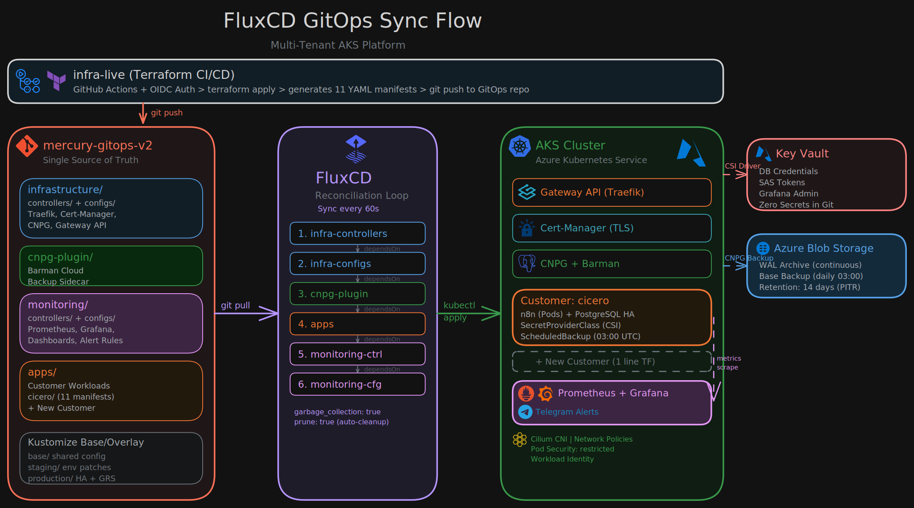

# Mercury GitOps v2

Kubernetes manifests for multi-tenant AKS, managed by FluxCD. This repository serves as the single source of truth for all cluster resources across staging and production environments.

## FluxCD Sync Flow

  

## Stack

| Component | Tool | Purpose |
|-----------|------|---------|
| GitOps | FluxCD | Automated sync every 60s |
| Ingress | Gateway API (Traefik) | Traffic routing + TLS termination |
| TLS | Cert-Manager + Let's Encrypt | Automatic certificate provisioning |
| Database | CNPG + Barman Cloud | PostgreSQL HA with automated backups |
| Monitoring | Prometheus + Grafana | Metrics, dashboards, Telegram alerts |
| Secrets | Azure Key Vault CSI Driver | Zero secrets in Git |
| Network | Cilium CNI + Network Policies | Tenant isolation |
