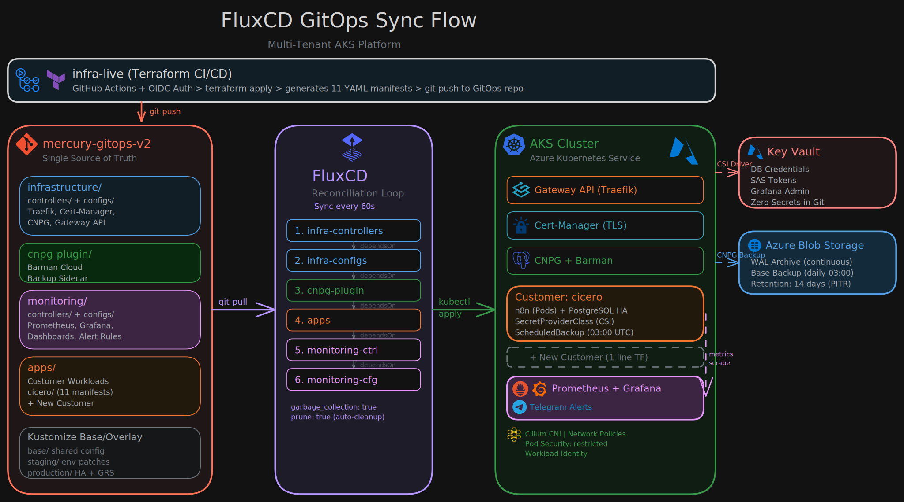

# Mercury GitOps v2

Kubernetes manifests for multi-tenant AKS, managed by FluxCD. This repository serves as the single source of truth for all cluster resources across staging and production environments.

## FluxCD Sync Flow

  

